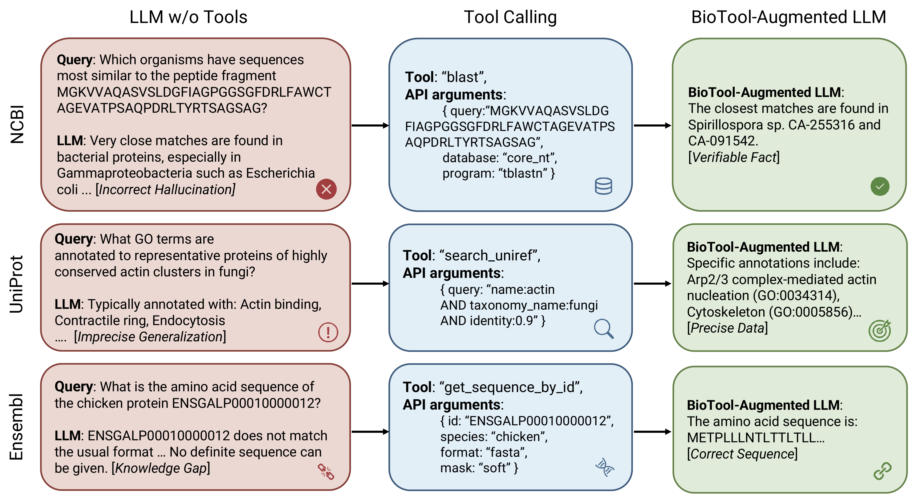

# BioTool: A Comprehensive Tool-Calling Dataset for Enhancing Biomedical Capabilities of Large Language Models

[](https://arxiv.org/abs/2605.05758)
[](https://huggingface.co/datasets/gxx27/BioTool)
[](https://huggingface.co/gxx27/BioTool-finetuned-Qwen3-4B)





## 🔍 Overview

This repository accompanies the paper *"BioTool: A Comprehensive Tool-Calling Dataset for Enhancing Biomedical Capabilities of Large Language Models."* We release a large-scale, function-calling dataset for the biomedical domain that pairs general biomedical questions with biomedical tool calls that provide sufficient information to answer them.

We release:

- **BioTool dataset** — 7,040 curated `(query, function_call, observation)` triples spanning **127 tools** across NCBI, UniProt, and Ensembl, plus an 80/20 ShareGPT-style train/test split.
- **BioTool Python wrappers** — working clients for every one of the 127 tools.
- **Evaluation pipeline** — BioTool Score + Exact-Match + API success, with per-database breakdowns.
- **BioTool-finetuned-Qwen3-4B** — a fully fine-tuned 4B-parameter model that is the strongest open-source baseline in our paper.


## 📊 Dataset

The BioTool dataset is hosted on Hugging Face: [`gxx27/BioTool`](https://huggingface.co/datasets/gxx27/BioTool). It bundles five JSON files:

| File | Description | Rows |
| --- | --- | --- |
| `BioTool.json` | Raw `(user_query, function_calling, observation)` records — the standard function-calling format. | 7,040 |
| `BioTool_train.json` | Training split in LLaMA-Factory ShareGPT format. | 5,632 |
| `BioTool_test.json` | Held-out test split in LLaMA-Factory ShareGPT format. | 1,408 |
| `tools.json` | JSON-Schema definitions of all 127 tools. | 127 |
| `function_mapping.json` | Function-name → `{database, tool}` lookup used by the evaluation pipeline. | 127 |

### Tool coverage

| Database | Sub-tools |
| --- | --- |
| **NCBI** | E-utilities (`einfo`, `esearch`, `esummary`, `efetch`, `elink`, `ecitmatch`) and **BLAST** |
| **UniProt** | `uniprotkb`, `uniref`, `uniparc`, `proteomes`, `taxonomy`, `keywords`, `human_diseases`, `subcellular_locations`, `literature_citations`, `arba`, `unirule`, `genecentric`, `cross_referenced_databases` |
| **Ensembl** | `lookup`, `sequence`, `overlap`, `vep`, `comparative_genomics`, `linkage_disequilibrium`, `phenotype_annotation`, `variation`, `variant_ga4gh`, `cross_references`, `information`, `mapping`, `regulation`, `archive`, `transcript_haplotypes`, `ontology_and_taxonomy` |

### Example record

`BioTool.json` follows the standard function-calling format:

```json
{
  "user_query": "Which UniProt protein entries correspond to the TP53 gene?",
  "function_calling": {
    "name": "stream_uniprotkb",
    "arguments": {"query": "gene:TP53", "fields": "cc_ptm,sequence", "sort": "gene desc"}
  },
  "observation": {
    "total_results": 25,
    "examples": [
      {"accession": "A0A8J4YEJ4", "entryType": "UniProtKB unreviewed (TrEMBL)"},
      {"accession": "A0A0A9W1L4", "entryType": "UniProtKB unreviewed (TrEMBL)"}
    ]
  },
  "database": "uniprot",
  "tool": "uniprotkb"
}
```

`BioTool_train.json` / `BioTool_test.json` use the LLaMA-Factory ShareGPT layout (`conversations` + `tools`), so they can be passed directly to `llamafactory-cli train`.


## 🧪 Metrics

For every test example we report three metrics, broken down by source database (NCBI / UniProt / Ensembl) and overall:

- **Exact Match (EM, %)** — the predicted `{name, arguments}` matches the gold call exactly.
- **API Success (AS, %)** — either an exact match, *or* the predicted call returns a non-error response from the live BioTool.
- **BioTool Score (%)** — `1.0` if EM, otherwise the cosine similarity in MedCPT-Query-Encoder embedding space between the predicted and gold API responses (`0.0` if either call fails).

See the paper for full per-database and per-model results.


## 🚀 Quickstart

### 1. Installation

We recommend a fresh conda environment with Python 3.11:

```bash
conda create -n biotool python=3.11
conda activate biotool

git clone https://github.com/gxx27/BioTool.git
cd BioTool
pip install -r requirements.txt
```

### 2. Download the dataset

```bash
huggingface-cli download gxx27/BioTool \
    --repo-type dataset \
    --local-dir data
```

Or from Python:

```python
from huggingface_hub import snapshot_download
snapshot_download(
    repo_id="gxx27/BioTool",
    repo_type="dataset",
    local_dir="data",
)
```

The five JSON files (`BioTool.json`, `BioTool_train.json`, `BioTool_test.json`, `tools.json`, `function_mapping.json`) end up under `data/`.

You can also load the train/test splits directly with 🤗 `datasets`:

```python
from datasets import load_dataset
ds = load_dataset("gxx27/BioTool")
print(ds)
```

### 3. Download the fine-tuned model (optional)

```bash
huggingface-cli download gxx27/BioTool-finetuned-Qwen3-4B \
    --local-dir checkpoints/BioTool-Qwen3-4B
```

Or from Python:

```python
from transformers import AutoModelForCausalLM, AutoTokenizer
tok = AutoTokenizer.from_pretrained("gxx27/BioTool-finetuned-Qwen3-4B")
mdl = AutoModelForCausalLM.from_pretrained(
    "gxx27/BioTool-finetuned-Qwen3-4B",
    torch_dtype="auto",
    device_map="auto",
)
```

### 4. API Configuration

Set your OpenRouter key (only needed for the closed-source baselines GPT-5.1 / GPT-5.1-Codex / Claude / Gemini):

> The Gemini 3.0 Pro model used in the paper is unavailable in OpenRouter; similar results can be obtained using the Gemini 3.1 Pro model.

```bash
export OPENROUTER_API_KEY=<your_openrouter_key>
```

### 5. Running Evaluation

The evaluation pipeline lives entirely in `script/`. Everything uses paths relative to the repo root.

#### Closed-source baselines (OpenRouter)

```bash
bash script/run_eval.sh openrouter
# -> writes results/{gpt5_1,gpt5_1_codex,claude,gemini}.jsonl
```

#### Open-source models (LLaMA-Factory)

Drop the YAMLs from [`llamafactory_cfgs/`](llamafactory_cfgs) into a LLaMA-Factory checkout and run them; see [`llamafactory_cfgs/README.md`](llamafactory_cfgs/README.md) for the full instructions. The headline run is:

```bash
llamafactory-cli train examples/train_full/qwen3_4b.yaml          # fine-tune Qwen3-4B
llamafactory-cli train examples/train_full/qwen3_4b_predict.yaml  # generate predictions on the test split
```

#### Score predictions

```bash
# 1. Exact Match + live BioTool calls (no GPU)
bash script/run_eval.sh evaluate \
    results/gpt5_1.jsonl:analysis/gpt5_1.json \
    LLaMA-Factory/saves/qwen3_4b/full/predict/generated_predictions.jsonl:analysis/qwen3_4b.json

# 2. MedCPT response similarity (GPU briefly)
bash script/run_eval.sh similarity analysis/gpt5_1.json analysis/qwen3_4b.json

# 3. Print per-database EM / AS / BioTool Score
bash script/run_eval.sh metrics analysis/qwen3_4b.json
```

### 6. Calling any of the 127 BioTool tools

Each tool is a vanilla Python function:

```python
import sys; sys.path.insert(0, ".")
from ensembl.lookup.api import lookup_by_symbol
print(lookup_by_symbol(species="human", symbol="BRCA1"))
```


## 📁 Repository layout

```
BioTool/
├── data/                       Cleaned, reproducibility-ready dataset
│   ├── BioTool.json
│   ├── BioTool_train.json
│   ├── BioTool_test.json
│   ├── tools.json
│   └── function_mapping.json
├── ncbi/  uniprot/  ensembl/   BioTool Python wrappers
│   └── <tool>/{api,postprocess}.py
├── script/                     Evaluation pipeline (paper-reproducing)
│   ├── openai_eval_func.py     OpenRouter inference for closed-source models
│   ├── unified_evaluate.py     EM + API + similarity + metrics + tables
│   ├── concurrent_evaluate.py  Parallel evaluator (BLAST / non-BLAST queues)
│   ├── run_eval.sh             Convenience wrapper
│   └── data_construction/      How the dataset itself was built
├── llamafactory_cfgs/          Training & inference YAMLs
├── figs/                       Figures used in the paper
└── README.md
```

## 🚧 Future Works

Here're some problems remaining to be explored:

- **Beyond one-hop interactions:** This paper focuses on one-hop settings, which are better suited to relatively simple biomedical problems and single-turn interactions. A key next step is extending the framework to support multi-hop conversations and multi-step tool invocation pipelines so agents can solve more complex biomedical tasks.
- **From SFT to RL for biomedical agents:** While supervised fine-tuning (SFT) already yields strong performance, future work can explore reinforcement learning (RL) that jointly optimizes tool invocation and response generation. This direction should explicitly handle the substantial distributional shift between biomedical data and base-model pretraining corpora, where high-entropy uncertainty is often unavoidable.

If you have additional ideas or are interested in collaborating on this line of work, feel free to reach out!


## 📚 Citations

If you find this work or dataset useful, please cite:

```bibtex
@misc{gao2026biotoolcomprehensivetoolcallingdataset,
      title={BioTool: A Comprehensive Tool-Calling Dataset for Enhancing Biomedical Capabilities of Large Language Models},
      author={Xin Gao and Ruiyi Zhang and Meixi Du and Peijia Qin and Pengtao Xie},
      year={2026},
      eprint={2605.05758},
      archivePrefix={arXiv},
      primaryClass={cs.CL},
      url={https://arxiv.org/abs/2605.05758},
}
```


## 📧 Contact

Questions or feedback, please contact:

xig022@ucsd.edu, ruz048@ucsd.edu, p1xie@ucsd.edu


## 📄 License

Code is released under the Apache 2.0 license. The dataset is intended for research use; the underlying API responses are subject to the licenses of the original NCBI, UniProt, and Ensembl services.
